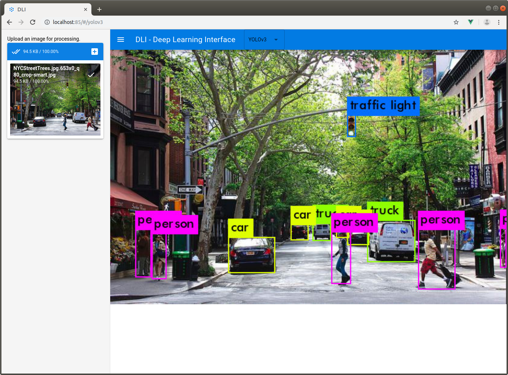

# DLI  
Deep Learning Interface: A web app for interfacing with deep learning algorithms.  
  

## Overview  
DLI is a web based system for using deep learning algorithms and visualizing their results. Currently it only supports object detection in images using the YOLOv3 algorithm (https://pjreddie.com/media/files/papers/YOLOv3.pdf); however, I am planning on adding other algorithms in the future.  

## Installation and Usage (Linux)  
Clone the repository  

Download docker and docker-compose  
https://docs.docker.com/install/  
https://docs.docker.com/compose/  

cd into the DLI directory and run the command below to host DLI  
`docker-compose up --build`

Once everything is done downloading, try going to http://localhost:85/ in a web browser.  

You should be greeted with the DLI web application. From here you can select the algorithm you want to run and use the tools in the sidebar to send your data to the algorithm.  

The app can also be accessed from any client device on the local network by determining the ip address of the host machine and going to the proper url. For example: http://192.168.123.132:85/ (the port will always be 85 unless it is changed in the docker-compose.yml file and the nginx.conf file). All of the processing is done on the host machine, and the UI is updated dynamically on the client device with the results.  
